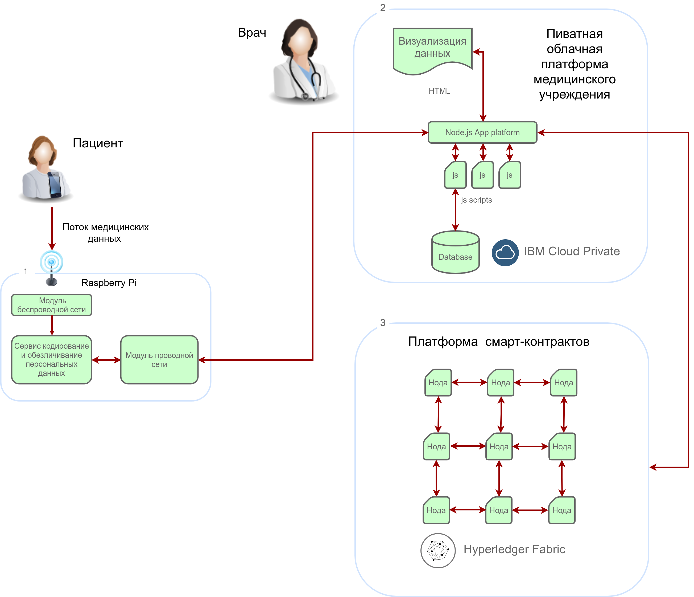

****
# Введение 

Воплощение потенциала идей, заложенных в концепцию Интернета вещей, способно существенно изменить уклад современной экономики. Благодаря внедрению масштабируемых облачных решений, использованию большого количества датчиков и распределенных микропроцессорных систем уже в ближайшее время могут быть созданы прорывные решения в таких областях, как: транспорт, сельское хозяйство, промышленное производство, здравоохранение, социальная сфера, быт и других. Все большее количество компаний обращает внимание на применение идей и технологий Интернета вещей для внедрения аналитики их деятельности и поиска новых возможностей для продуктов и услуг.

> *Интернет вещей (англ. Internet of Things, IoT) — это концепция вычислительной сети физических объектов («вещей»), оснащённых встроенными технологиями для взаимодействия друг с другом или с внешней средой.*
> 

Перечислим некоторые интересные факты:
-   По оценкам специалистов, к 2020 году к сети Интернет будет подключено до 50 млрд устройств, 20 млрд из них будут задействованы в инфраструктуре IoT.

-   До 90% данных, анализируемых устройствами Интернета вещей ранее не подвергались обработке.
-   До 60% данных, получаемых устройствами Интернета вещей, остаются актуальными лишь несколько миллисекунд.
-   В настоящее время только 0,1% устройств, способных выполнять полезную вычислительную нагрузку, подключены к сети.

По данным аналитических агенств растет количество проектов применения технологий IoT в медицине. Аналитики обнаружили, что 17% из передовых медицинских проектов используют концепцию IoT, а почти 30% проектов работают над интеграцией технологий в медицинскую практику. Статистика ясно показывает: медицинские компании заинтересованы в работе с новыми технологиями и готовы сотрудничать с разработчиками новых решений.

Однако, существенной проблемой при реализации проектов IoT в медицине является уязвимость данных. Серверы, используемые для подключения устройств IoT и обмена критическими медицинскими данными, должны обладать высокой надежностью. Одним из решений, повышающих надежность хранения информации является технология блокчейн, которая способна защитить процесс хранения посредством децентрализации и шифрования. 
Применение технологии блокчейн позволит получать и анализировать информацию о здоровье пациента, передаваемую устройствами, находящимися в контакте с пациентом. При этом становится возможным получать оперативную информацию и использовать ее для различных целей. Возможными преимуществами такого оперативного контроля за состоянием пациентов могут являтся: оперативное реагирование, оптимизация расходов, повышеие качества медицинских услуг.

****
## Инфраструктура типового решения IoT 

> 
>Под типовым решением Интернета вещей в данном конкурсе понимается распределенная кибер-физическая система, интегрирующая вычислительные ресурсы в физические процессы. В такой системе должны быть реализованы следующие основные функции:
> 

-   Сбор первичных данных с помощью сенсоров, расположенных в непосредственной близости от реальных объектов.
-   Управление объектами через актуаторы, подключенные к микрокомпьютерам.
-   Передача первичных данных от микрокомпьютеров в вычислительный хаб и в обратном направлении.
-   Первичная обработка данных в вычислительном хабе, формирование пакетов данных для передачи их в облако.
-   Получение и хранение данных в облаке.
-   Аналитическая обработка в облаке и формирование ключевых показателей эффективности (KPI) на основе данных об объектах, данных от сторонних источников, исторических данных.
-   Визуализация данных и результатов анализа на различных платформах: мобильных устройствах, носимой электронике, планшетах, компьютерах, мониторах и пр.
-   Прием команд от внешних управляющих консолей.
-   Принятие решений на основе KPI и команд, выработка управляющих и информационных сообщений для актуаторов.
-   Передача управляющих сообщений в вычислительные хабы.

Примером подобной системы является структура, представленная на следующем рисунке.

**Пример решения Интернета вещей**

> 
> Мы используем в качестве примера распределенную систему мониторинга состояния пациентов на основе системы смарт-контрактов.***
> 
> Смарт-контракт (англ. Smart contract — умный контракт) — компьютерный алгоритм, предназначенный для заключения и поддержания коммерческих контрактов в технологии блокчейн.
> 

Системы смарт-контрактов позволяют сохранить информацию о произошедших событиях в надежном и распределенном хранилище, построенной по технологии цепочки блоков (blockchain). Это обеспечивает следующие преимущества подобных систем, которые могут быть применены в области медицины:

- Надежное хранение последовательности событий и невозможность искажения ранее записанной информации.
- Открытый доступ к информации о событиях и, как следствие, открытая аналитика на основе данных системы blockchain.
- Использование данных для взаимодействия потребителей и  поставщиков (пациентов и клиник, покупателей и производителей лекарств, страховых компаний и клиник и т.п.)

Стоит сразу отметить, что данные о здоровье человека являются персональными данными, в связи с чем ее использование должно быть деперсонализированы. Поэтому вся информация персонального характера должна храниться в закрытых хранилищах. Мы используем приватную облачную платформу для реализации функций хранения.

****
## Проект хакатона 

Всем командам предлагается собрать template-проект, который может быть модифицирован командами для реализации собственных идей.  
В проекте использовано следующее оборудование:

-   Смартфон под управлением операционной системы `Android` или `IOS` в качестве средства диагностики состояния пациента.
-   Микрокомпьютер `RaspberryPi` используется в качестве вычислительного хаба для сбора данных с датчиков и средств диагностики состояния пациента.
-   Облачная платформа `IBM Cloud Private` используется для реализации сервисов аналитической обработки и визуализации данных о пациентах в приватном медицинском учреждении (с возможностью полного доступа к персональной информации).
-   Блокчейн-платформа `Hyperledger Fabric` используется для реализации публичного распределенного реестра сервиса хранения деперсонифицированной информации.

Система работает следующим образом. 

Пациент использует медицинский прибор для измерения некоторых параметров состояния (артериального давления, уровня сахара в крови, пульса, и т.д). Возможно также использование диалоговой диагностической системы или чат-ботов, выявляющих и анализирующих состояние человека. Мы будем использовать мобильный телефон для сбора первичных данных. 

Далее, мобильный телефон передает данные через беспроводной интерфейс (мы используем беспроводную сеть WiFi) на вычислительных хаб (одноплатный компьютер `Raspberry Pi`).  На вычислительном хабе функционируют Node.js сервер, который выполняет первичную обработку данных, и, при необходимости ее деперсонализацию. 

Данные из вычислительного хаба передаются в облачную платформу `IBM Cloud Private`, в которой развернут сервисы хранения и визуализации данных. На основе этой информации врач может принять решение о проведении дополнительных процедур, выписке пациенту необходимых лекарство, дополнительной консультативной поддержки и прочих обоснованных действиях, вытекающих из истории наблюдений.

**Функциональная схема проекта**

Для формировании истории наблюдений, используемых другими специалистами, а также сторонними участниками, деперсонализированная информация сохраняется в публичной blockchain платформе `Hyperledger Fabric`. Мы развернем кластер `Hyperledger Fabric` на публичной облачной платформе `IBM Cloud`.
 

