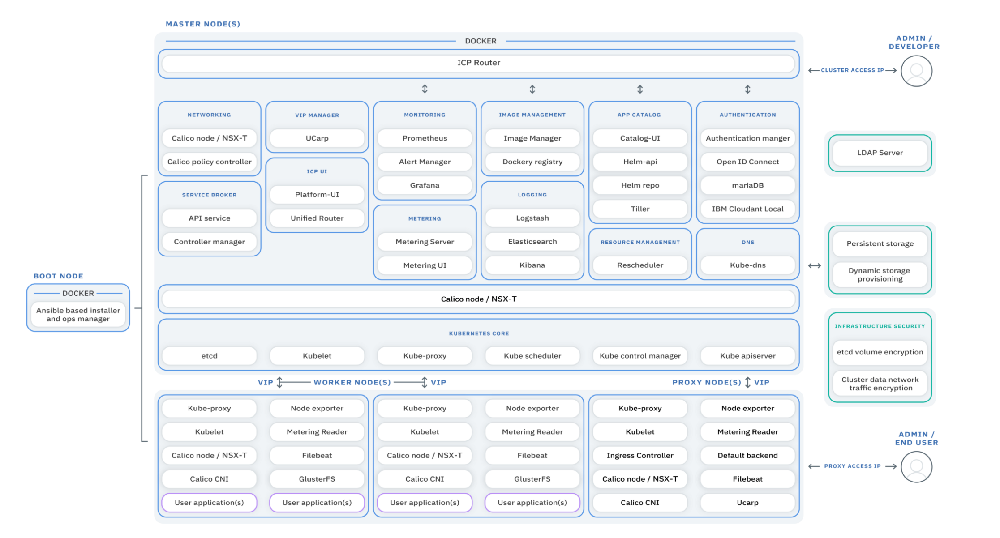

****
# День 3 <a name="day3"></a>


## Обзор IBM Cloud Private <a name="41"></a>

**IBM Cloud Private** является частной облачной платформой для разработки и выполнения рабочих нагрузок на локальных серверах предприятий. Это интегрированная среда, которая позволяет вам разрабатывать, развертывать и управлять локальными облачными приложениями, расположенными внутри инфраструктуры ЦОД, что позволяет в большей степени защитить данные. Он включает в себя контейнерный оркестратор Kubernetes, частный репозиторий образов, консоль управления и различные системы мониторинга.

### Что такое приватные облака? <a name="411"></a>

Частное облако - это облачная вычислительная модель, предназначенная исключительно для одной организации. К ее управлению могут быть допущены только доверенные лица, имеющию полномочия по доступу в частную сеть предприятия. Частное облако предлагает преимущества публичного облака, включая быстрое развертывание и масштабируемость, а также простоту использования и эластичность, но также обеспечивает больший контроль, повышенную производительность, предсказуемые затраты, более строгую безопасность и гибкие возможности управления. 


### Архитектура IBM Cloud Private <a name="412"></a>

Основными элементами **ICP** являются:
* Система управления Linux-контейнерами **Docker** - программное обеспечение для автоматизации развёртывания и управления приложениями в среде виртуализации на уровне операционной системы. Позволяет «упаковать» приложение со всем его окружением и зависимостями в контейнер, который может быть перенесён на любую Linux-систему с поддержкой cgroups в ядре, а также предоставляет среду по управлению контейнерами.
* Система оркестрации Linux-контейнеров **Kubernetes** -  открытое программное обеспечение для автоматизации развёртывания, масштабирования и управления контейнеризированными приложениями. Поддерживает основные технологии контейнеризации, включая Docker, rkt, также возможна поддержка технологий аппаратной виртуализации. 



### Терминология <a name="413"></a>

**Kubectl:** - CLI (интерфейс командной строки) для Kubernetes

**Мастер-нода** [master node] - главный компьютер, который управляет нодами и является точкой входа [entry point] для всех административных задач.

**Рабочая нода** [worker node] - Это рабочий сервер в Kubernetes, на котором запускаются Docker контейнеры. Рабочие ноды управляются Мастер-нодой. 

**Kubelet** - агент, запущенный на ноде, который следит за выполнением задач в контейнерах.

На наших рисунках кое-чего не хватает. Kubernetes управляет контейнерами не напрямую, а через поды. Поды описывают, как выполнять один контейнер или несколько одновременно.

**Развертывание** [deployment] - описание инфраструктуры некоторого решения, запускаемого в виде контейнеров. Развертывание может увеличивать или сокращать количество запущеннных инстансов приложений для изменения параметров производительности.  Развертывание обычно описывается в виде `yaml` файла. Например развертывание сервиса балансировки сетевого траффика выглядит следующим образом:

```yaml
	apiVersion: apps/v1
	kind: Deployment
	metadata:
	  name: nginx-deployment
	  labels:
	    app: nginx
	spec:
	  replicas: 3
	  selector:
	    matchLabels:
	      app: nginx
	  template:
	    metadata:
	      labels:
		app: nginx
	    spec:
	      containers:
	      - name: nginx
		image: nginx:1.15.4
		ports:
		- containerPort: 80
```
 
**Под** - это один экземпляр развертывания, обладающий своим уникальным IP адресом в кластере. У одного развертывания может быть несколько подов. При удалении Пода все данные удаляются, поэтому для долговременного данных и их исопльзования в других подах следует подключать внешние тома или сетевые хранилища. 


**Секрет** [secret] — это объект, который хранит конфиденциальные данные, например, имена пользователей и пароли.

**Сервис** - поддерживаемый системой оркестрации ресурс, обеспечивающий сетевой доступ к подам. В Kubernetes определены три типа сервисов:

1. IP кластера [ClusterIP]

	– Развертывание доступно только внутри кластера.
	– Каждому развертыванию присваивается внутренний IP-адрес кластера.
	– Трафик распределяется между подами развертывания через балансировку нагрузки.

2. Порт ноды [node port]

	– Развертывание доступно внутри кластера.
	– Развертывание привязано к порту мастер-ноды.
	– Каждая нода будет проксировать этот порт для вашего сервиса.
	– Сервис доступен по http(s)://:/.
	–Трафик распределяется между подами развертывания через балансировку нагрузки.

3. Балансировщик нагрузки [load balancer]

	– Развертывание получает общедоступный IP-адрес.
	– Сервис доступен по http(s)://:<80||42>/.
	–Трафик распределяется между подами развертывания через балансировку нагрузки.

 

[Подробные учебные материалы на английском языке](https://github.com/phthom/IBMCloudPrivate)

## Доступ к web консоли управления IBM Cloud Private <a name="42"></a>

Доступ к ICP МГТУ осуществляется по следующим адресам:

* https://195.19.40.201:8443

или

* https://icp.bmstu.ru:8443


Для доступы к Web интерфейсу Вы должны получить логин и пароль от преподавателя.

Web-консоль управления может исопльзоваться для мониторина ресурсов, создания различных сервисов и развертываний, запуска подов и пр.
Вместе с этим возможен командный способ доступа ко всем ресурсам облака с помощью утилит `kebectl`, `ibmcloud / bx pr`, `helm` и `docker`.


## Доступ к IBM Cloud Private с помощью консольных утилит<a name="43"></a>

Для выполнения заданий хакатона понадобится установить на вашем локальном компьютере `docker`, консоль `bx` и плагин `pr`, а ткже консоль `kubectl`.

### Установка консолей <a name="431"></a>

Выполните в консоли команду:

`curl -sL https://ibm.biz/idt-installer | bash`

Далее следуйте инструкциям по установке. 

Для non-Linux систем смотрите подробную инструкцию [тут](https://console.bluemix.net/docs/cli/index.html#overview).

Проверьте работу плагина `bx`:

`bx --help`

### Установка плагина ICP<a name="432"></a>

Далее перейдите в web-консоли на страницу установки плагинов CLI: Menu > Command Line Tools > Cloud Private CLI. Скачайте файл плагина, соответствующий вашей операционной системе.

Для установки скачанного плагина в `ОС Linux amd64` используйте команду:

`bx plugin install <path_to_installer>/icp-linux-amd64`

Для других ОС команды можно узнать [тут](https://www.ibm.com/support/knowledgecenter/SSBS6K_2.1.0.3/manage_cluster/install_cli.html)


Проверьте, что плагин IBM Cloud Private работает:

`bx pr --help`

Выполним вход на наш кластер ICP:

`bx pr login -a https://icp.bmstu.ru:8443 --skip-ssl-validation`


### Получение доступа консоли kubectl к ICP <a name="433"></a>

Далее Вам необходимо получить токен для доступа к ICP. Токен валиден только в течении 12 часов, поэтому мы автоматизируем процесс получения токена и валидации доступа. Создайте файл `connectICP.sh` со следующим содержанием:

```sh
CLUSTERNAME=bmstu.ru
ACCESS_IP=195.19.40.201
USERNAME=xxxxxxxxx
PASSWD=xxxxxxxx

token=$(curl -s -k -H "Content-Type: application/x-www-form-urlencoded;charset=UTF-8" -d "grant_type=password&username=$USERNAME&password=$PASSWD&scope=openid" https://$ACCESS_IP:8443/idprovider/v1/auth/identitytoken --insecure | jq .id_token | awk  -F '"' '{print $2}')

kubectl config set-cluster icp.$CLUSTERNAME --server=https://$ACCESS_IP:8001 --insecure-skip-tls-verify=true
kubectl config set-context icp.$CLUSTERNAME-context --cluster=icp.$CLUSTERNAME
kubectl config set-credentials $USERNAME --token=$token
kubectl config set-context icp.$CLUSTERNAME-context --user=$USERNAME --namespace=$USERNAME
kubectl config use-context icp.$CLUSTERNAME-context
```

Укажите в файле Ваш логин и пароль в полях `USERNAME=` и `PASSWD=`. Сохраните файл.

Далее необходимо разрешить запуск скрипта:

`chmod +x connectICP.sh`

Запустите скрипт:

`./connectICP.sh`

В итоге вы должны получить следующий ответ:

```sh
Cluster "cluster.local" set.
Context "cluster.local-context" modified.
User "team00" set.
Context "cluster.local-context" modified.
Switched to context "cluster.local-context".
```

Выполните вход на сервер ICP:

`kubectl version --short`

Более подробно о дуступе и получении токена вы можете прочитать [тут](https://www.ibm.com/support/knowledgecenter/SSBS6K_2.1.0.3/manage_cluster/cfc_cli.html)

### Доступ docker к ICP <a name="434"></a>

Укажите в файле `/etc/hosts` путь к серверу `ICP`:

`195.19.40.201 icp.bmstu.ru`

Создайте на Вашем компьютере папку для хранения ключей:

`sudo mkdir /etc/docker/certs.d/icp.bmstu.ru:8500/`

Для доступа к кластеру с помощь локального docker менеджера вам понадобится `ca.crt`. Ключ будет послан Вам по почте преподавателем.

Положите полученный ключ в папку `/etc/docker/certs.d/icp.bmstu.ru:8500/`

На клиентском компьютере перезапустите службу Docker:

`sudo service docker restart`

Войдите в свой личный реестр изображений.

`sudo docker login icp.bmstu.ru:8500`

В ответ вы должны получить следующее сообщение:

```
Authenticating with existing credentials...
WARNING! Your password will be stored unencrypted in /home/team00/.docker/config.json.
Configure a credential helper to remove this warning. See
https://docs.docker.com/engine/reference/commandline/login/#credentials-store

Login Succeeded
```

## Создание docker образа и его развертывание на ICP <a name="44"></a>

В этом разделе мы создадим и настроим docker образ для развертывания в ICP. Далее мы запустим развернутый образ и создадим работающий "под". Доступ к поду будет осуществляться по `ssh`.

## Создание docker образа <a name="441"></a>

Создайте на своем локальном компьютере файл с именем `Dockerfile` со следующим содержимым:

```
FROM ubuntu:16.04

RUN apt-get update && apt-get install -y openssh-server
RUN mkdir /var/run/sshd
RUN echo 'root:hackathon' | chpasswd
RUN sed -i 's/PermitRootLogin prohibit-password/PermitRootLogin yes/' /etc/ssh/sshd_config

RUN sed 's@session\s*required\s*pam_loginuid.so@session optional pam_loginuid.so@g' -i /etc/pam.d/sshd

ENV NOTVISIBLE "in users profile"
RUN echo "export VISIBLE=now" >> /etc/profile

EXPOSE 22
CMD ["/usr/sbin/sshd", "-D"]
```

Файл описывает контейнер, основанный на `Ubuntu Linux 16.04`. Далее при создании образа будет выполнена установка openssh сервера, а также разрешен вход по ssh пользователю root и паролю hackathon. Вы можете поменять пароль для доступа к  машине.

Выполните сборку образа:

`sudo docker build -t hack_sshd .`

Далее роверьте работоспособность образа на локальном компьютере:

```
sudo docker run -d -P --name test_sshd hack_sshd
sudo docker port test_sshd 22
```

В итоге контейнер будет запущен и Вам будет выдан ip адрес и порт:

`0.0.0.0:49154`

Обратите внимание, что адрес `0.0.0.0` не является адресом контейнера. Вам нужно узнать параметры сети docker по команде `ipconfig`

```
docker0: flags=4163<UP,BROADCAST,RUNNING,MULTICAST>  mtu 1500
        inet 172.17.0.1  netmask 255.255.0.0  broadcast 172.17.255.255
        inet6 fe80::42:b8ff:feda:5831  prefixlen 64  scopeid 0x20<link>
        ether 02:42:b8:da:58:31  txqueuelen 0  (Ethernet)
        RX packets 0  bytes 0 (0.0 B)
        RX errors 0  dropped 0  overruns 0  frame 0
        TX packets 68  bytes 11048 (11.0 KB)
        TX errors 0  dropped 0 overruns 0  carrier 0  collisions 0
```

Зайдите в контейнер по команде:

```
ssh root@172.17.0.1 -p 32768
The authenticity of host '[172.17.0.1]:32768 ([172.17.0.1]:32768)' can't be established.
ECDSA key fingerprint is SHA256:S4g5OT66u04YzEY9ck8S0n29HJ728CmeRFVKy0OhBc8.
Are you sure you want to continue connecting (yes/no)? 
```

Выйдите из сессии ssh по команде `exit`. Установите и удалите образ из локального компьютера, т.к. мы будем развертывать его далее только в ICP.

```sh
sudo docker container stop test_sshd
``` 

## Развертывание docker образа в ICP <a name="442"></a>

Далее подготовим образ к передачи в репозиторий ICP. Укажем имя образа и репозиторий (вам необходимо указать доступный вам namespace вместо `team00`):

`sudo docker tag hack_sshd icp.bmstu.ru:8500/team00/hack_sshd`

Далее передаем образ в ICP:

`sudo docker push icp.bmstu.ru:8500/team00/hack_sshd`

Теперь образ находится на сервере и Вы можете обнаружить его на странице Images:


Аналогичный результат вы получите, использовав команду:

`kubectl get images`

Далее уточним активный namespace:

`kubectl config current-context`

Если не установлен нужный нам `namespace`=`ваш логин`, установим его:

`kubectl config set-context my-context --namespace=team00`

Теперь мы можем развернуть образ на кластере ICP:

`kubectl run team00ubuntu --image=icp.bmstu.ru:8500/team00/hack_sshd`

Проверить выполнение команды можно следующим образом:

```sh
kubectl get pods
AME                            READY     STATUS    RESTARTS   AGE
team00ubuntu-67bfd95cd9-94b65   1/1       Running   0          11s
```

Далее необходимо разрешить форвардинг портов к нашему Поду. Для этого используем команду `expose`:

`kubectl expose deployment team00ubuntu --type=LoadBalancer --port=22 —target-port=22`

Осталось узнать порт, который использовал Kubernetes для форвардинга в порт 22 нашего Пода:

```
kubectl get svc
NAME                       TYPE           CLUSTER-IP   EXTERNAL-IP   PORT(S)        AGE
team00ubuntu                     LoadBalancer   10.0.0.126   <pending>     22:30646/TCP   1m
```

Нам был выделен порт 30646. Теперь мы можем обратиться к нашему контейнеру:

```
ssh root@195.19.40.201 -p 30646
The authenticity of host '[195.19.40.201]:30646 ([195.19.40.201]:30646)' can't be established.
ECDSA key fingerprint is SHA256:S4g5OT66u04YzEY9ck8S0n29HJ728CmeRFVKy0OhBc8.
Are you sure you want to continue connecting (yes/no)? 
```
Подробнее об использовании docker в ICP вы можете прочитать [тут](https://github.com/phthom/IBMCloudPrivate/blob/master/2-DockerLab.md)

### Запуск Пода с испольщованием yaml конфигуратора <a name="443"></a>

Под можно создать как из обаза, сохраненного локально в ICP, так и с помощью файла конфигурации yaml. В последнем случае можно описать инфраструктуру контейнеров, входящих в один Под. В следующем примере мы создадим контейнер на основе репозиторя Kubernetes, доступного всем пользователям.

Создадим Под nginx:

`kubectl create -f https://k8s.io/examples/application/shell-demo.yaml`

Получим доступ к консоли bash Пода: 

`kubectl exec -it shell-demo -- /bin/bash`
`root@shell-demo:/`

Подробнее о синтаксисе yaml можно прочесть [тут](https://www.mirantis.com/blog/introduction-to-yaml-creating-a-kubernetes-deployment/)

