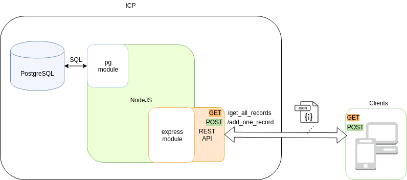

# День 4 <a name="day4"></a>

## Развертывание портала и системы хранения в *IBM Cloud Private* <a name="51"></a>


В этом разделе мы развернем `СУБД PostgreSQL` на облачной платформе `IBM Cloud Private`, а также разработаем приложения для получения и хранения медицинских данных, передаваемых мобильным приложением.




**PostgreSQL** — свободная объектно-реляционная система управления базами данных (СУБД). 


### Основы работы с СУБД PostgreSQL:  установка и базовые операции <a name="511"></a>

Для получения навыков работы с `PostgreSQL` будем использовать контейнер Ubuntu, созданный в предыдущем разделе. Для этого зайдите в консоль ssh. 

Далее устанавливаем СУБД:

`sudo apt-get install postgresql`

Запускаем СУБД (если Вы используете пользователя root, то команду sudo использовать не нужно):

`sudo /etc/init.d/postgresql start`

Входим в консоль управления `PostgreSQL`:

`sudo -u postgres psql`

Обратите внимание, что при установке `PostgreSQL` создается пользователь `postgres`, не имеющий домашней директории. Поэтому запись логов и файлов блокировки процессов будет невозможна:

```
~ $ sudo -u postgres psql
[sudo] password for user: 
could not change directory to "/home/user"
psql: could not connect to server: No such file or directory
Is the server running locally and accepting
connections on Unix domain socket "/var/run/postgresql/.s.PGSQL.5432"?
```
Поэтому перед запуском команды следует перейти в `/tmp`, доступ на запись в которую для пользователя `postgres` разрешен.


Создаём базу данных:

`CREATE DATABASE my_db_1;`

Далее можно просмотреть список существующих баз данных:

`psql \l`

Подключиться к базе данных:

`psql \c my_db_1`

Создать таблицу:

`CREATE TABLE people (man TEXT, age INTEGER);`

Посмотреть список таблиц внутри базы данных:

`psql \dt`

Посмотреть тип полей определённой таблицы:

`psql \d people`

Вставка значений в таблицу:

`INSERT INTO people (man, age) VALUES ('John', 21);`

`INSERT INTO people (man, age) VALUES ('Doe', 25);`

Вывести на экран всё содержимое таблицы:

`SELECT * FROM people;`

Обновление записей в таблице:

`UPDATE people SET age = 40 WHERE man = 'John';`

Удаление записей в таблице:

`DELETE FROM people WHERE age = 40;`

Удаление таблицы из базы данных

`DROP TABLE people;`

Удаление всей базы данных:

`DROP DATABASE my_db_1;`

Более подробную информацию по работе с PostgreSQL вы можете найти [тут](https://maxim218.gitbooks.io/postgresql/content/)
 

### Развертывание СУБД PostgreSQL и Node.js сервера в одном контейнере <a name="512"></a>

Развернем новый контейнер в `ICP`, в котором установим СУБД PostgreSQL и Node.js сервер. Для этого будем использовать следующий `Docker` файл:

```
FROM ubuntu:16.04

MAINTAINER Kolotovkin Maxim

RUN apt-get -y update
ENV PGVER 9.5
RUN apt-get install -y postgresql-$PGVER

USER postgres
RUN /etc/init.d/postgresql start &&\
    psql --command "ALTER USER postgres WITH SUPERUSER PASSWORD 'XXXXXX';" &&\
    createdb -E utf8 -T template0 -O postgres my_database &&\
    /etc/init.d/postgresql stop

RUN echo "synchronous_commit = off" >> /etc/postgresql/$PGVER/main/postgresql.conf
RUN echo "fsync = off" >> /etc/postgresql/$PGVER/main/postgresql.conf

EXPOSE 5432

VOLUME  ["/etc/postgresql", "/var/log/postgresql", "/var/lib/postgresql"]

USER root
RUN apt-get -y update
RUN apt-get install -y nodejs
RUN apt-get install -y npm
RUN apt-get install -y nodejs-legacy

ENV APP /root/app
ADD ./ $APP

WORKDIR $APP

RUN npm install forever -g

RUN npm install

EXPOSE 80

RUN apt-get update && apt-get install -y openssh-server
RUN mkdir /var/run/sshd
RUN echo 'root:hackathon' | chpasswd
RUN sed -i 's/PermitRootLogin prohibit-password/PermitRootLogin yes/' /etc/ssh/sshd_config

RUN sed 's@session\s*required\s*pam_loginuid.so@session optional pam_loginuid.so@g' -i /etc/pam.d/sshd

ENV NOTVISIBLE "in users profile"
RUN echo "export VISIBLE=now" >> /etc/profile

EXPOSE 22

WORKDIR $APP

CMD service postgresql start && forever start index.js && /usr/sbin/sshd -D
```

Замените `XXXXXX` на пароль суперпользователя postgres. 


Скачайте тестовый проект ICP_nptest. Для этого скачайте [git репозиторий](https://github.com/alexbmstu/2018.git) с помощью команды wget.

Вам понадобится архив в папке `./scr`. 

Создайте в папке с Вашим Docker файлом папку app:

`mkdir app`

Распакуйте архив ICP_nptest.zip в папку `app`. Ознакомьтесь с кодом приложения Node.js. Укажите пароль пользователя `postgres` в файле `index.js`.


Далее соберите и запускаем контейнер на сервере (см инструкции к День 3). 

Далее необходимо разрешить форвардинг портов к нашему Поду. Для
этого используем команду expose. Обратите внимание, нужно явно указывать уникальные имена сетевых сервисов:

```
$ kubectl expose deployment team00nodeapi --name=ssh00nodeapi --type=LoadBalancer --port=22 —target-port=22
service "ssh00nodeapi" exposed

$ kubectl expose deployment team00nodeapi --name=http00nodeapi --type=LoadBalancer --port=80 —target-port=80
service "http00nodeapi" exposed
```

Осталось узнать порты, которые использовал Kubernetes для форвардинга в порты 22 и 80 нашего Пода:

`$ kubectl get svc`


В результате получаем сообщение о назначении портов:

```
22/tcp -> 195.10.40.201:32776
80/tcp -> 195.10.40.201:32775
```

Подключаемся по ssh:

`ssh root@195.19.40.201 -p 32776`

Тестируем ноду в браузере по url: `http://195.19.40.201:32775/`

`HELLO NODE API`

Проверим работу node в мэнэджере `forever`:

```
root@48958c2527b2:~# forever list
info: Forever processes running
data: 	uid 	command 	script 	forever 		pid 	id 	logfile 			uptime
data:	[0] 	iiut 		/usr/bin/nodejs index.js 	48	54	/root/.forever/iiut.log 	0:0:2:37.967
```

Проверим как заполнилась БД. Для этого необходимо изменить текущего пользователя в системе:

```
root@a1eb5093b309:~/app# su - postgres
```

Входим в режим работы с psql:

```
postgres@a1eb5093b309:~$ psql
psql (9.5.14)
Type "help" for help.
```

Далее выдадим список всех БД в системе:

```
postgres=# \l
List of databases
Name         | Owner    | Encoding  | Collate | Ctype | Access privileges
-------------+----------+-----------+---------+-------+-----------------------
my_database  | postgres | UTF8      | C       | C     | 
postgres     | postgres | SQL_ASCII | C       | C     |
template0    | postgres | SQL_ASCII | C       | C     | =c/postgres +
             |          |           |         |       | postgres=CTc/postgres
template1    | postgres | SQL_ASCII | C       | C     | =c/postgres +
             |          |           |         |       | postgres=CTc/postgres
(4 rows)
```

Просмотрим список таблиц в базе my_database: 

```
postgres=# \c my_database
You are now connected to database "my_database" as user "postgres".
my_database=# \dt
List of relations
Schema  | Name   | Type  | Owner
--------+--------+-------+----------
public  | people | table | postgres
(1 row)
```

Просмотрим содержимое таблицы people

```
my_database=# select * from people;
```

Для выхода в root:

```
my_database=# \q
postgres@b639e9351a69:~$ exit
```


## Тестирование Node.js сервера <a name="52"></a>


Тест приложения пожно выполнить с помощью браузерного плагина `Postman` (подробнее об установке `Postman` можно прочитать [тут](https://www.getpostman.com/docs/v6/postman/launching_postman/installation_and_updates)).


Примеры тестовых POST и GET запросов показаны ниже:
 


Для POST запросов на добавление используйте ссылку вида:

`http://195.19.40.201:32789/add_one_record`

Формат данных в теле запроса json следующего вида

```
{
"nickname": "Nick",
"age": 23
}
``` 

Для GET запросов на выборку используйте ссылку вида:

`http://195.19.40.201:32789/get_all_records`

Формат ответа - массив json-обьектов вида:

`[{"man_id":"1","man_nickname":"Nick","man_age":23}]`
 
Код проекта подробно описан [тут](https://maxim218.gitbooks.io/nodejs/content/chapter1.html).


Далее Вы можете проверить появление записей в таблицах базы данных `PostgreSQL` при выполнении запросов POST и их выдачу в ответ на запросы GET.


**Задание 1: Разделите Docker файл на два таким образом, чтобы:**

**- СУБД PostgreSQL работала в одном контейнере и была доступна по ssh протоколу извне.**

**- Фронтенд Node.js работал в другом контейнере и был доступен по ssh и по http.**

**- Контейнеры взаимодействовали между собой через внутреннюю виртуальную сеть Kubernetes (для этого потребуется настройка приложения Node.js на соединение с контейнером PostgreSQL).**


Для выполнения задания Вам понадобится создать локальный сетевой сервис типа `ClusterIP` для доступа к `Postgres` 

```
kubectl expose deployment team99db --name=team99-db-postgres --target-port=5432 --port=5432
```

Проверить выполнение предыдущей команды можно с помощью команды:

```
kubectl get svc, в качестве адреса для сервера берём CLUSTER-IP
```

После этого, код подключения к БД от сервера будет выглядеть следующим образом:

```
   // Описываем функцию создания нового клиента для подключения к БД
   function createNewClient() {
        return new pg.Client({
            user: 'postgres',
            host: '<CLusterIP>', // Внутренний IP ноды с Postgresql
            database: 'my_database',
            password: 'hackathon',
            port: '5432' // Порт Postgreqsl
        });
   }
```

Далее нужно настроить `postgreSQL` 

```
nano /etc/postgresql/9.5/main/postgresql.conf
```

Нужно раскоментировать строки и изменить `localhost` на `'*'`

```
          listen_addresses = 'localhost'
          password_encryption = on
```
    
Далее нужно разрешить сетевой доступ по IPv4:
 
```
nano /etc/postgresql/9.5/main/pg_hba.conf
    Здесь добавить
    # IPv4 External but internal to cluster connections
    host    all             all             10.0.0.0/8               md5
```

Теперь можно перезапустить `postgreSQL`:

```
    /etc/init.d/postgresql restart
```


**Задание 2: модифицируйте код приложения таким образом, чтобы оно принимало формат json пакетов от вашего мобильного приложения.**

Обратите внимание, что docker контейнер PostgreSQL использует временное дисковое пространство для размежения файлов БД. Поэтому при удалении или сбое в работе контейнера данные будут потеряны. Чтобы избежать этого, необходимо предоставить контейнеру PostgreSQL доступ к долговременному хранилищу. Более подробно информацию о выделении хранилища в ICP можно найти [тут](https://www.ibm.com/support/knowledgecenter/SS4GSP_6.2.7/com.ibm.udeploy.install.doc/topics/docker_pVolumes.html)
 
Для создания хранилища каждой команды в `ICP` сделан `PV` для каждой команды размером 4Gi. 

Вы можете создавать claim-запрос ресурса через консоль "Create resource" web gui с помощью следующего yaml (имя team00 и namespace нужно поменять)

```
{
  "apiVersion": "v1",
  "kind": "PersistentVolumeClaim",
  "metadata": {
    "name": "team00-pvc",
    "namespace": "team00",
    "annotations": {
      "pv.kubernetes.io/bind-completed": "yes",
      "pv.kubernetes.io/bound-by-controller": "yes"
    },
    "finalizers": [
      "kubernetes.io/pvc-protection"
    ]
  },
  "spec": {
    "accessModes": [
      "ReadWriteMany"
    ],
    "resources": {
      "requests": {
        "storage": "4Gi"
      }
    },
    "volumeName": "team00-pv-rwm"
  }
}
```


